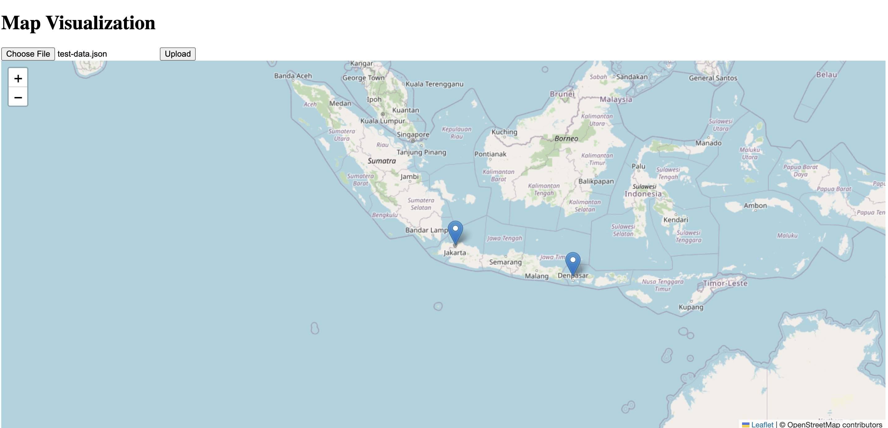

# geolocation




pre-requisite :
1. install docker

2. to run the apps, build and run the docker-compose

```shell script
docker-compose up --build
```

3. enter http://localhost:8080 on browser

4. upload the sample json files, located at test/resources/test-data.json

5. swagger can be accessed at http://localhost:8080/q/swagger-ui
